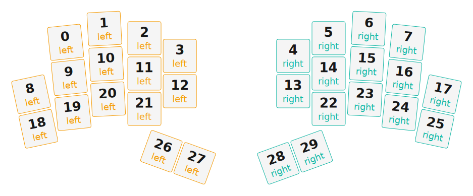

# ZMK Configuration for phaethornis

*Generated by Shield Wizard for ZMK*



Download compiled firmware from the Actions tab. <https://zmk.dev/docs/user-setup#installing-the-firmware>

Edit your keymap <https://zmk.dev/docs/keymaps>.
User keymap is located at [`config/phaethornis.keymap`](config/phaethornis.keymap).

-----

<details>
<summary>
Shield Wizard Debug Information
</summary>

In case of broken configuration, here is the Shield Wizard internal data used to generate this configuration:

Commit: 8a52249f61161469b6d90ed8c80c4aa52b9f3858

```json
{"name":"phaethornis","shield":"phaethornis","dongle":false,"modules":[],"layout":[{"id":"01KH111050SJXSNK2TYVA563YX","part":0,"row":0,"col":1,"w":1,"h":1,"x":1.07,"y":0.414,"r":-6,"rx":1.57,"ry":0.914},{"id":"01KH111050VRFT69XBDMHGYQ6X","part":0,"row":0,"col":2,"w":1,"h":1,"x":2.169,"y":0.025,"r":-3,"rx":2.669,"ry":0.525},{"id":"01KH1110509Y5E0BR0QEQDPYYW","part":0,"row":0,"col":3,"w":1,"h":1,"x":3.302,"y":0.297,"r":0,"rx":0,"ry":0},{"id":"01KH1110505WF497WRCQMKQB9V","part":0,"row":0,"col":4,"w":1,"h":1,"x":4.304,"y":0.798,"r":0,"rx":0,"ry":0},{"id":"01KH111050M64FMVRMHC4031BG","part":1,"row":0,"col":5,"w":1,"h":1,"x":7.514,"y":0.798,"r":0,"rx":0,"ry":0},{"id":"01KH111050X84B77B310X61EQF","part":1,"row":0,"col":6,"w":1,"h":1,"x":8.517,"y":0.297,"r":0,"rx":0,"ry":0},{"id":"01KH111050MH0TMDE249SRBPN6","part":1,"row":0,"col":7,"w":1,"h":1,"x":9.65,"y":0.025,"r":3,"rx":10.15,"ry":0.525},{"id":"01KH111050AQ05RVCK085NF6M0","part":1,"row":0,"col":8,"w":1,"h":1,"x":10.748,"y":0.414,"r":6,"rx":11.248,"ry":0.914},{"id":"01KH111050CYTZFYK7HW2B0Y6T","part":0,"row":1,"col":0,"w":1,"h":1,"x":0.093,"y":1.886,"r":-12,"rx":0.593,"ry":2.386},{"id":"01KH111050EFSPZY4EPDQS2W5D","part":0,"row":1,"col":1,"w":1,"h":1,"x":1.175,"y":1.411,"r":-6,"rx":1.675,"ry":1.911},{"id":"01KH111050XEYDZRDN6RM7G9XS","part":0,"row":1,"col":2,"w":1,"h":1,"x":2.221,"y":1.027,"r":-3,"rx":2.721,"ry":1.527},{"id":"01KH111050M9EGWM9N2SCB40Z5","part":0,"row":1,"col":3,"w":1,"h":1,"x":3.302,"y":1.299,"r":0,"rx":0,"ry":0},{"id":"01KH111050Z6BPYN6PPFZY64V5","part":0,"row":1,"col":4,"w":1,"h":1,"x":4.304,"y":1.801,"r":0,"rx":0,"ry":0},{"id":"01KH1110506HKX4WQNNCDGJVPY","part":1,"row":1,"col":5,"w":1,"h":1,"x":7.514,"y":1.801,"r":0,"rx":0,"ry":0},{"id":"01KH111050SVH1W62AE8HDDXD0","part":1,"row":1,"col":6,"w":1,"h":1,"x":8.517,"y":1.299,"r":0,"rx":0,"ry":0},{"id":"01KH111050G3RASAAYRB4CN4SK","part":1,"row":1,"col":7,"w":1,"h":1,"x":9.597,"y":1.027,"r":3,"rx":10.097,"ry":1.527},{"id":"01KH111050P2WWJ3QJPEHCNWS0","part":1,"row":1,"col":8,"w":1,"h":1,"x":10.643,"y":1.411,"r":6,"rx":11.143,"ry":1.911},{"id":"01KH111050GZGJSZYR08PS29BS","part":1,"row":1,"col":9,"w":1,"h":1,"x":11.725,"y":1.886,"r":12,"rx":12.225,"ry":2.386},{"id":"01KH111050944NS0KEBN0S2NVX","part":0,"row":2,"col":0,"w":1,"h":1,"x":0.301,"y":2.867,"r":-12,"rx":0.801,"ry":3.367},{"id":"01KH11105051EBM9JXJ6G90A56","part":0,"row":2,"col":1,"w":1,"h":1,"x":1.28,"y":2.408,"r":-6,"rx":1.78,"ry":2.908},{"id":"01KH111050G6BNM3YN9NGKY3J3","part":0,"row":2,"col":2,"w":1,"h":1,"x":2.274,"y":2.028,"r":-3,"rx":2.774,"ry":2.528},{"id":"01KH1110508743HMPEQQM9WPQC","part":0,"row":2,"col":3,"w":1,"h":1,"x":3.302,"y":2.302,"r":0,"rx":0,"ry":0},{"id":"01KH1110505YFCHTRSK5DSSR4V","part":1,"row":2,"col":6,"w":1,"h":1,"x":8.517,"y":2.302,"r":0,"rx":0,"ry":0},{"id":"01KH1110506B9KK25B9N14A5BJ","part":1,"row":2,"col":7,"w":1,"h":1,"x":9.545,"y":2.028,"r":3,"rx":10.045,"ry":2.528},{"id":"01KH111050M8XM2SC5Q5QKEKZQ","part":1,"row":2,"col":8,"w":1,"h":1,"x":10.539,"y":2.408,"r":6,"rx":11.039,"ry":2.908},{"id":"01KH1110506BNFHP2J4245AED1","part":1,"row":2,"col":9,"w":1,"h":1,"x":11.517,"y":2.867,"r":12,"rx":12.017,"ry":3.367},{"id":"01KH111050TNDWJ695TCVFHP92","part":0,"row":3,"col":3,"w":1,"h":1,"x":3.783,"y":3.503,"r":20,"rx":4.283,"ry":4.003},{"id":"01KH11105071PC02R6JPMNZ3MX","part":0,"row":3,"col":4,"w":1,"h":1,"x":4.725,"y":3.846,"r":20,"rx":5.225,"ry":4.346},{"id":"01KH111050KCA8E1AZ9R3P3Z3T","part":1,"row":3,"col":5,"w":1,"h":1,"x":7.093,"y":3.846,"r":-20,"rx":7.593,"ry":4.346},{"id":"01KH111050HVQP5887VRD668VW","part":1,"row":3,"col":6,"w":1,"h":1,"x":8.035,"y":3.503,"r":-20,"rx":8.535,"ry":4.003}],"parts":[{"name":"left","controller":"xiao_ble","wiring":"matrix_diode","pins":{"d2":"output","d3":"output","d4":"output","d5":"output","d6":"output","d10":"input","d9":"input","d8":"input","d7":"input"},"keys":{"01KH1110505WF497WRCQMKQB9V":{"input":"d10","output":"d2"},"01KH111050Z6BPYN6PPFZY64V5":{"input":"d9","output":"d2"},"01KH11105071PC02R6JPMNZ3MX":{"input":"d7","output":"d2"},"01KH1110509Y5E0BR0QEQDPYYW":{"input":"d10","output":"d3"},"01KH111050M9EGWM9N2SCB40Z5":{"input":"d9","output":"d3"},"01KH1110508743HMPEQQM9WPQC":{"input":"d8","output":"d3"},"01KH111050TNDWJ695TCVFHP92":{"input":"d7","output":"d3"},"01KH111050VRFT69XBDMHGYQ6X":{"input":"d10","output":"d4"},"01KH111050XEYDZRDN6RM7G9XS":{"input":"d9","output":"d4"},"01KH111050G6BNM3YN9NGKY3J3":{"input":"d8","output":"d4"},"01KH111050SJXSNK2TYVA563YX":{"input":"d10","output":"d5"},"01KH111050EFSPZY4EPDQS2W5D":{"input":"d9","output":"d5"},"01KH11105051EBM9JXJ6G90A56":{"input":"d8","output":"d5"},"01KH111050CYTZFYK7HW2B0Y6T":{"input":"d9","output":"d6"},"01KH111050944NS0KEBN0S2NVX":{"input":"d8","output":"d6"}},"encoders":[],"buses":[{"name":"spi0","devices":[],"type":"spi"},{"name":"spi1","devices":[],"type":"spi"},{"name":"spi2","devices":[],"type":"spi"},{"name":"spi3","devices":[],"type":"spi"},{"name":"i2c0","devices":[],"type":"i2c"},{"name":"i2c1","devices":[],"type":"i2c"}]},{"name":"right","controller":"xiao_ble","wiring":"matrix_diode","pins":{"d2":"output","d3":"output","d4":"output","d5":"output","d6":"output","d10":"input","d9":"input","d8":"input","d7":"input"},"keys":{"01KH111050M64FMVRMHC4031BG":{"input":"d10","output":"d2"},"01KH1110506HKX4WQNNCDGJVPY":{"input":"d9","output":"d2"},"01KH111050KCA8E1AZ9R3P3Z3T":{"input":"d7","output":"d2"},"01KH111050X84B77B310X61EQF":{"input":"d10","output":"d3"},"01KH111050SVH1W62AE8HDDXD0":{"input":"d9","output":"d3"},"01KH1110505YFCHTRSK5DSSR4V":{"input":"d8","output":"d3"},"01KH111050HVQP5887VRD668VW":{"input":"d7","output":"d3"},"01KH111050MH0TMDE249SRBPN6":{"input":"d10","output":"d4"},"01KH111050G3RASAAYRB4CN4SK":{"input":"d9","output":"d4"},"01KH1110506B9KK25B9N14A5BJ":{"input":"d8","output":"d4"},"01KH111050AQ05RVCK085NF6M0":{"input":"d10","output":"d5"},"01KH111050P2WWJ3QJPEHCNWS0":{"input":"d9","output":"d5"},"01KH111050M8XM2SC5Q5QKEKZQ":{"input":"d8","output":"d5"},"01KH111050GZGJSZYR08PS29BS":{"input":"d9","output":"d6"},"01KH1110506BNFHP2J4245AED1":{"input":"d8","output":"d6"}},"encoders":[],"buses":[{"name":"spi0","devices":[],"type":"spi"},{"name":"spi1","devices":[],"type":"spi"},{"name":"spi2","devices":[],"type":"spi"},{"name":"spi3","devices":[],"type":"spi"},{"name":"i2c0","devices":[],"type":"i2c"},{"name":"i2c1","devices":[],"type":"i2c"}]}]}
```

</details>
